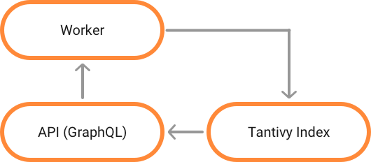

Collecting information about the people visiting your site is crutial - if you want to know who is visiting your site. In the case of this blog, I would like to know if anyone is reading my posts. A lot of great solutions already exist. The most popular one is _Google Analytics_. Their 'free' offering will work perfectly for most people and is used by most sites you visit.

I don't like the business model of _Google Analytics_. It exists to serve advertisers - so it tries to collect as much information as possible. Also, not all of that information is exposed to the entity running the site. For example, there is no way to export all data collected by _Google Analytics_. That means that at some point you will have to opt into their _Google Analytics 360_ plan - which offers deeper insights.

So I decided to create my own "Google Analytics" - **with a focus on privacy**.

### But wait... have you considered other options?

"Google Analytics" is far from the only analytics platform out there. Some of the ones I have considered are:

- Heap Analytics
- Amplitude
- Simple Analytics

Just to be clear, I do not think this solution will be better than any of those. The main purpose of this solution is killing time and having something to write about.

### What is an analytics platform?

To me, an analytics platform is **a system for aggregating events**. In that defenition there are two main words that need explaination - **event** and **aggregation**.

Let's start by looking at what I mean by an **event**. An event in this context can be any action the user is doing on the site - loading the page, clicking a button, hovering the mouse over an element.... You get the point. In code, that event could look something like:

```rust
struct Event {
    id: string,
    session_id: string, // Identifier for the session.
    tag: string, // What action?
    timestamp: u64, // When?
    browser: string, // With what browser.
}
```

These events will be generated while the user is visiting the site.

This event will be triggered and information will be transfered from the browser to the server.

```json
{
  "id": "1",
  "tag": "hit",
  "timestamp": 1231,
  "browser": "Chrome 17.1"
}
```

The role of an analytics platform in this case is to store that event in a way where someone can get value from the event. The mo

<!-- Should spend some time on explaining why aggregations are important --->

## So whats your plan?

Tantivy is a really cool library for search. I've been trying to contribute to it, and will try to keep my contributions up. Most of my work has gone into the simple operation of making search go backwards. Anyways, it is a good library for this task.


