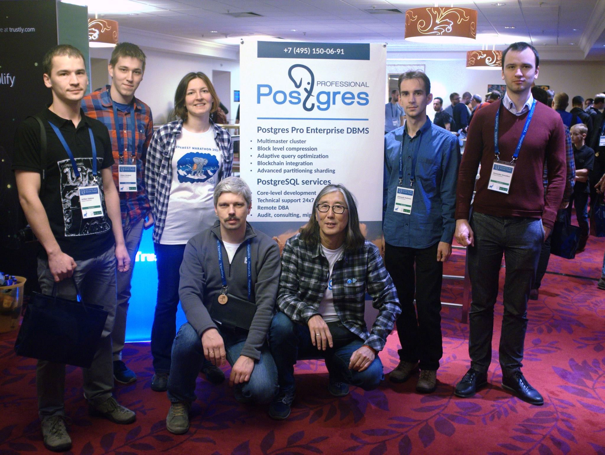

<!-- Prewriting
Idea:
Write an article comparing Postgres with MySQL.
Fleshing out:
- History 
- Community
- Features
- Performance numbers
- Benchmarks from other places 
- Licence 
- Support on Cloud platforms

Structure
    Introduction
        SQL is a common laguage.
        MS SQL, Oracle Database are on the way out.
        Postgres and MySQL are on the way up
        An article for people like me that have no idea what the benefits of each database is.
    Main
        Features
            Both use sql
                (need sources)
            MySQL history
                (need sources)
            MySQL features
                (need sources)
            Postgres history
                (need sources)
            Postgres features
                (need sources)
            Comparing features
        Community 
            Based on features
            Companies using MySQL
            Companies using PostgreSQL
        Performance
            Benchmarks are always bad
            Can give an indication
            Go throught 3 different benchmarks comparing them.
        Implementation
            Try to reason about the performance given the features.
        Hosted solutions
            Available
            Replication and scaling
    Conclusion
        ...

Sources
https://en.wikipedia.org/wiki/MySQL
https://en.wikipedia.org/wiki/PostgreSQL
-->

SQL has been the "language of databases" longer than I've been alive (21 years). For a long time, the only way to get a SQL database was paying tons of money for a licence. Two databases prevailed as the winners of that aera - MSSQL and Oracle Database. Recently, a new generation of open-source SQL databases have taken over. Most young companies use an open-source database like MySQL or PostgreSQL.

MySQL and Postgres are very simular - at least that is my perception. I've looked into the differences between them before, and I wanted to collect my findings in an article.

### So what are the differences?

History is a good place to start. Postgres and MySQL where released at about the same time - 25 years ago - with an open-source licence. But their origins are quite different.

Postgres came out of *UC Berkeley*, where development started in 1985. Papers where published and versions were released. In 1994 the project ended and the code was released under a modified MIT licensce.

> **Funfact**: the project was based on a previous project named '*ingres*', so they named it '*postgres*'.

Origionally, postgres did not use SQL. It used a laguage based on the previous project (ingres). This changed in 1994, when a new SQL front-end was developed. The named was changed to PostgreSQL in 1996 to reflect the change.

Development has continued, but everything has been open-source from then.

Image above: *Postgres Professional development team as of 2017*

In summary, Postgres comes from the research world. Later it became an open-source project. 

MySQL on the other hand stems from *MySQL AB*. *MySQL AB* was a swedish company that existed until Oracle killed it... Ok - maybe Oracle didn't kill it, but it did buy it for $1B in 2010. It has two versions - one for open source and one for enterprise. There is also an open source fork named *MarinaDB*.

...
<!-- Write more about MySQL history -->

| Feature | MySQL  | Postgres |
| --- | --- | --- |
| SQL | 1985 | 1996 |

#### Postgres only features:
* Geographic support.

#### MySQL only features:
* Geographic support.

### I understand, but what are the communities like now?

### But there must be some performance differences, right?

### Why is the performance different?

### I've made my pick, how do I host it?

## So which one is better?

